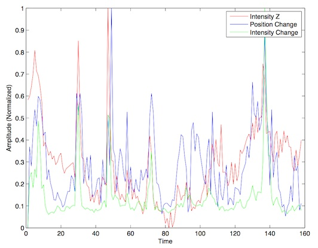
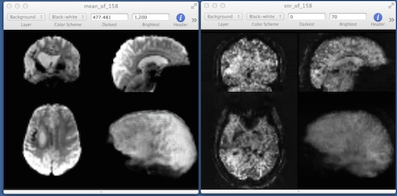

## Quality Assurance (QA)

With MRI a noisy image can contaminate your whole dataset, substantially reducing your statistical power. It is important to have a rigorous method to ensure the quality of the raw data and to establish that the automated processing worked as expected. Two common sources of error are artifacts in the raw data and poor normalization quality. This web page describes a simple automated Matlab script that can assist your manual quality assurance (QA) protocol.

   
##### Checking fMRI and resting state data

This script identifies 3D volumes that look unusual. It does this both for the overall image brightness (finding volumes where the pattern of brightness differs from the mean for the series) as well as changes in brightness (identifying volumes that are most dissimilar to the previous volume in time). It generates a visual plot (shown on the right) and a tab-delimited text file (that you can view with your favorite spread sheet software) that shows these changes across time and with respect to changes in head position. For example, if you look at the plot illustrated on this web page, note that volumes that appear unusual based on overall Z-score (red) or change in brightness (green) are associated with periods when the individual made relatively large head movements (blue). To conduct this analysis, you provide your series of brain images as well as the motion-correction parameters from FSL (a text file with the extension .par) or SPM (named rp_*.txt). In addition the software generates images that show the voxelwise patterns for mean, standard deviation and signal-to-noise. Therefore, this software combines the QA suggestions of Power et al. (2012) for illustrating motion related changes and the method of Murhpy et al. (2007). As described by Power et al., these images can be useful for identifies volumes that can contaminate your analysis.

The `nii_qa_moco.m`  Matlab script provides this measure. It requires Matlab and SPM.

#####  Checking Normalization of anatomical scans

We can run a similar script to check the quality of normalization across participants. The differences here is that we do not have motion correction files and we will have to deal with the fast that the absolute image brightness is likely to be very different between participants (due to factors such as differences in shim, head size, etc). To run the script, type “nii_mean_std” from the Matlab command line. You will be asked to select the images you wish to analyze. These can be compressed (“.nii.gz” as generated by FSL) or uncompressed (“.hdr” or “.nii” as common with SPM) NIfTI images. This script can be run on a 4D dataset (e.g. a fMRI time series or a DTI series) or multiple 3D images that are expected to be aligned with each other (e.g. T1 scans from multiple individuals after normalization). The script computes a mean and standard deviation image for the population and then reports the mean Z-score for each image in the set. As output it generates a mean image, a standard deviation image and a [signal-to-noise ratio (SNR) image](https://pubmed.ncbi.nlm.nih.gov/17126038). You can visually inspect the volumes that were reported to have the most extreme values, and also inspect the mean, standard deviation and SNR maps to see if there are any slice interference effects or unusual dropouts of signal. When you run this script it will ask you if you want to normalize the intensity of each image – this is generally not required for data from the same session (e.g. a fMRI session), but it can be very helpful in assessing data from different individuals (e.g. T1 scans after normalization, where white matter always appears brighter than gray matter but the actual brightness is not calibrated between individuals).

The `nii_mean_stdev.m` script provides this measure. It requires Matlab and SPM.

#####  General Uses

Both scripts can assist other visual inspections, such as using a yoked-view to inspect how well normalization matched a template or inspecting the motion correction plots to look for abnormal types of head motion. Here are some links for artifacts you should be familiar with:
 
 - [Overview of artifacts](https://practicalfmri.blogspot.com/2011/11/understanding-fmri-artifacts.html) that are common for EPI fMRI sequences
 - [Spin history effects](https://imaging.mrc-cbu.cam.ac.uk/imaging/CommonArtefacts) often seen during head motion with interleaved acquisitions.
 - Poor normalization between individuals: this is often caused by a poor starting estimate. My [nii_setOrigin12](https://github.com/rordenlab/spmScripts) script can help reduce these.

##### Links

 - Pablo Velasco’s  [Data Quality tool](https://www.cns.nyu.edu/~pvelasco/).
 - [The CBU’s seminal web page describing diagnostics for FMRI](https://imaging.mrc-cbu.cam.ac.uk/imaging/DataDiagnostics).
 - [Artifact Detection Tools (ART)](https://www.nitrc.org/projects/artifact_detect/).
 - Power JD, Barnes KA, Snyder AZ, Schlaggar BL, Petersen SE. ([2012](https://pubmed.ncbi.nlm.nih.gov/22019881)) Spurious but systematic correlations in functional connectivity MRI networks arise from subject motion. Neuroimage. 59(3):2142-54.
 - [Sample datasets](https://fcon_1000.projects.nitrc.org/indi/retro/Power2012.html)
 - Murphy K, Bodurka J, Bandettini PA. ([2007](https://pubmed.ncbi.nlm.nih.gov/17126038)) How long to scan? The relationship between fMRI temporal signal to noise ratio and necessary scan duration. Neuroimage. 34(2):565-74.
 - Stöcker T, Schneider F, Klein M, Habel U, Kellermann T, Zilles K, Shah NJ. ([2005](https://pubmed.ncbi.nlm.nih.gov/15846770)) Automated quality assurance routines for fMRI data applied to a multicenter study. Hum Brain Mapp. 2005 Jun;25(2):237-46.
 - Davids M, Zöllner FG, Ruttorf M, Nees F, Flor H, Schumann G, Schad LR ([2014](https://pubmed.ncbi.nlm.nih.gov/24602825)) Fully-automated quality assurance in multi-center studies using MRI phantom measurements. Magn Reson Imaging. 32(6):771-80.